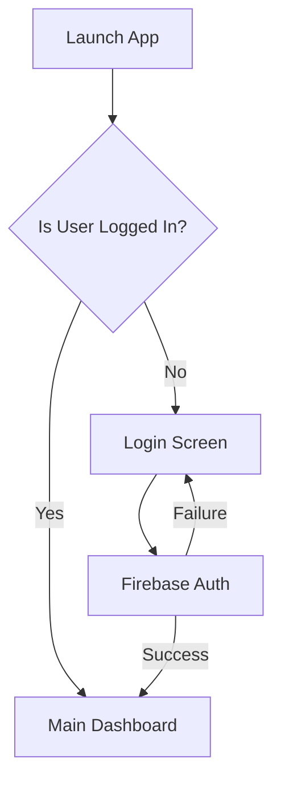
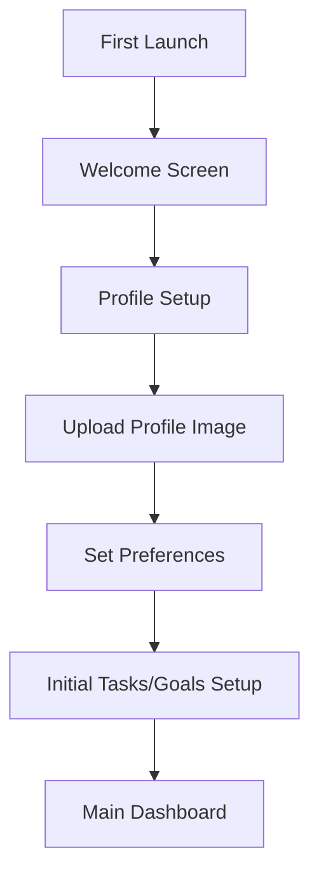
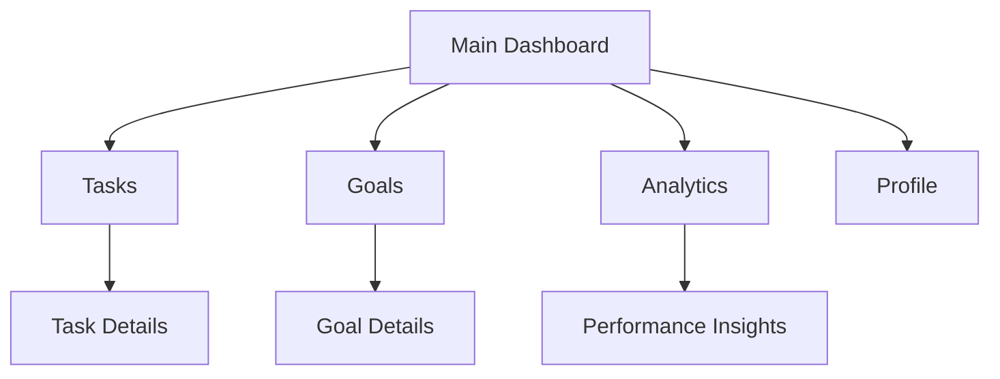

# SemHub Android App Flow

## Table of Contents
1. [App Architecture](#app-architecture)
2. [User Flow](#user-flow)
3. [Key Features](#key-features)
4. [Screen Navigation](#screen-navigation)
5. [Data Flow](#data-flow)
6. [UI/UX Guidelines](#uiux-guidelines)

## App Architecture

### Technology Stack
- Kotlin
- MVVM Architecture
- Jetpack Compose for UI
- Coroutines for async operations
- Hilt for dependency injection
- Room for local caching
- Firebase Authentication
- Retrofit for API calls

### Project Structure
```
app/
├── data/
│   ├── api/
│   ├── local/
│   ├── models/
│   └── repositories/
├── di/
├── domain/
│   ├── models/
│   ├── repositories/
│   └── usecases/
├── ui/
│   ├── components/
│   ├── screens/
│   ├── theme/
│   └── viewmodels/
└── utils/
```

## User Flow

### 1. Authentication Flow


### 2. Onboarding Flow


### 3. Main Navigation Flow


## Key Features

### 1. Task Management
- Create/Edit/Delete tasks
- Set priorities and deadlines
- Add subtasks
- Track progress
- Receive notifications

### 2. Goal Tracking
- Set long-term goals
- Link tasks to goals
- Track goal progress
- Visual progress indicators

### 3. Analytics Dashboard
- Task completion statistics
- Performance metrics
- Screen usage insights
- ML-based predictions

### 4. Smart Notifications
- Deadline reminders
- Progress updates
- Performance insights
- Optimal time suggestions

## Screen Navigation

### 1. Authentication Screens
- Splash Screen
- Login Screen
- Registration Screen
- Forgot Password

### 2. Onboarding Screens
- Welcome Screen
- Profile Setup
- Preferences Setup
- Initial Tasks/Goals

### 3. Main Screens
- Dashboard
- Task List
- Task Details
- Goal List
- Goal Details
- Analytics
- Profile

### 4. Modal Screens
- Add/Edit Task
- Add/Edit Goal
- Add/Edit Subtask
- Settings
- Notifications

## Data Flow

### 1. API Integration
```kotlin
// API Interface
interface SemHubApi {
    @GET("task/get-tasks")
    suspend fun getTasks(): List<Task>
    
    @POST("task/add-task")
    suspend fun addTask(@Body task: Task): Task
    
    @GET("analysis/ml-insights/{user_id}")
    suspend fun getMLInsights(@Path("user_id") userId: String): MLInsights
}
```

### 2. Local Caching
```kotlin
// Room Database
@Database(entities = [TaskEntity::class, GoalEntity::class], version = 1)
abstract class SemHubDatabase : RoomDatabase() {
    abstract fun taskDao(): TaskDao
    abstract fun goalDao(): GoalDao
}
```

### 3. Repository Pattern
```kotlin
class TaskRepository @Inject constructor(
    private val api: SemHubApi,
    private val db: SemHubDatabase
) {
    suspend fun getTasks(): Flow<List<Task>> {
        return flow {
            // Emit cached data first
            emit(db.taskDao().getAllTasks())
            
            // Fetch fresh data
            val tasks = api.getTasks()
            db.taskDao().insertAll(tasks)
            emit(tasks)
        }
    }
}
```

## UI/UX Guidelines

### 1. Theme
```kotlin
object Theme {
    val primary = Color(0xFF2196F3)
    val secondary = Color(0xFF03DAC6)
    val background = Color(0xFFF5F5F5)
    val surface = Color(0xFFFFFFFF)
    val error = Color(0xFFB00020)
}
```

### 2. Typography
```kotlin
object Typography {
    val h1 = TextStyle(
        fontSize = 24.sp,
        fontWeight = FontWeight.Bold
    )
    val body1 = TextStyle(
        fontSize = 16.sp,
        fontWeight = FontWeight.Normal
    )
}
```

### 3. Components
- Custom Task Card
- Progress Indicator
- Goal Progress Bar
- Analytics Charts
- Custom Bottom Navigation

### 4. Animations
- Task completion animation
- Progress updates
- Screen transitions
- Loading states

## Implementation Guidelines

### 1. State Management
```kotlin
class TaskViewModel @Inject constructor(
    private val repository: TaskRepository
) : ViewModel() {
    private val _tasks = MutableStateFlow<List<Task>>(emptyList())
    val tasks: StateFlow<List<Task>> = _tasks.asStateFlow()
    
    fun loadTasks() {
        viewModelScope.launch {
            repository.getTasks().collect { tasks ->
                _tasks.value = tasks
            }
        }
    }
}
```

### 2. Error Handling
```kotlin
sealed class Result<out T> {
    data class Success<T>(val data: T) : Result<T>()
    data class Error(val exception: Exception) : Result<Nothing>()
    object Loading : Result<Nothing>()
}
```

### 3. Navigation
```kotlin
sealed class Screen(val route: String) {
    object Dashboard : Screen("dashboard")
    object TaskList : Screen("tasks")
    object TaskDetail : Screen("task/{taskId}")
    object GoalList : Screen("goals")
    object Analytics : Screen("analytics")
}
```

## Performance Considerations

1. **Image Loading**
   - Use Coil for efficient image loading
   - Implement image caching
   - Lazy loading for lists

2. **Network Optimization**
   - Implement offline support
   - Use pagination for lists
   - Cache API responses

3. **Memory Management**
   - Proper lifecycle handling
   - Memory leak prevention
   - Efficient resource usage

## Testing Strategy

1. **Unit Tests**
   - ViewModel tests
   - Repository tests
   - Use case tests

2. **UI Tests**
   - Screen navigation tests
   - Component tests
   - Integration tests

3. **Performance Tests**
   - Memory leak tests
   - Network performance
   - UI rendering performance 